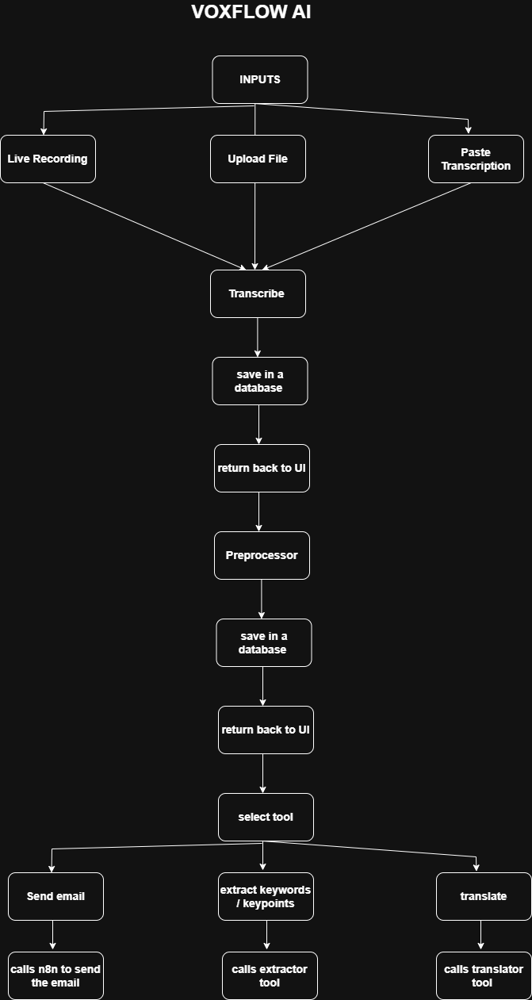

# 🎵 VOXFLOW AI (AI AUDIO PREPROCESSOR)

[](https://www.python.org/)
[](https://fastapi.tiangolo.com/)
[](https://reactjs.org/)
[](https://vitejs.dev/)
[](https://tailwindcss.com/)
[](https://github.com/openai/whisper)
[](https://opensource.org/licenses/MIT)

A powerful, AI-driven audio processing application that transcribes audio files, preprocesses transcriptions using advanced language models, and provides additional tools for text manipulation, translation, and communication. This project stands out due to its comprehensive AI engineering approach, featuring a robust FastAPI backend, a modern React frontend, and integrated Langfuse observability, showcasing diverse and complete AI engineering skillsets. Built with a modern web frontend and a robust Python backend.

## Why This Project Exists

In today's digital age, audio content is everywhere—from podcasts and lectures to meetings and personal recordings. However, converting this audio into actionable, clean text can be challenging. The Audio Preprocessor bridges this gap by providing:

- **Seamless Transcription**: Convert audio files to text using state-of-the-art AI models
- **Intelligent Preprocessing**: Clean and refine transcriptions using LLMs for better readability
- **Versatile Tools**: Extract text, translate languages, and send processed content via email
- **User-Friendly Interface**: An intuitive web app for easy audio processing
- **Extensible Architecture**: Modular design for easy addition of new features

This project aims to democratize access to advanced audio processing tools, making them available to developers, content creators, and everyday users.

Despite leveraging cutting-edge AI technologies, this project is designed to be straightforward and not overly complex. It solves real-world problems like efficiently transcribing meetings, lectures, or podcasts; cleaning up noisy transcriptions for better readability; and enabling quick actions like translation or email sharing. The modular architecture makes it easy to implement in real-life scenarios, whether for personal productivity, content creation, or business workflows, without requiring deep expertise in AI or full-stack development.

## About the Author

Hi! I'm a 17-year-old aspiring AI engineer passionate about building innovative AI projects. This Audio Preprocessor is one of my creations, born from my fascination with natural language processing, LLMs, and full-stack development. I believe in creating tools that solve real-world problems while pushing the boundaries of what's possible with AI.

This project marks a significant milestone for me as it features a clean, production-ready UI built with React, which is unique compared to my other projects that typically use Streamlit for rapid prototyping. Choosing React was a deliberate step towards creating more professional, scalable user interfaces suitable for real-world applications.

## ✨ Features

- 🎙️ **Audio Transcription**: Support for various audio formats using OpenAI Whisper
- 🧠 **AI-Powered Preprocessing**: Clean and refine transcriptions with GPT and DeepSeek models
- 🌐 **Multi-Language Support**: Translate processed text to over 50 languages
- 📧 **Email Integration**: Send processed results directly via email
- 📝 **Text Extraction**: Extract key information from processed text
- 🎨 **Modern UI**: Beautiful, responsive interface built with React and Tailwind CSS
- 🔄 **Real-time Processing**: Live audio recording and instant transcription
- 📊 **Data Persistence**: Store transcriptions and preprocessing results in JSON Lines format
- 🛠️ **Extensible Tools**: Modular architecture for adding new processing tools

## Demo

Check out the live demo video to see VoxFlow AI in action:

[](https://drive.google.com/file/d/101zJIK-EhDIe9sjDr-CCmYooAwVULH1Y/view?usp=sharing)

*Click the badge above to watch the demonstration.*

## Technologies Used

### Backend (Python)
- **FastAPI**: High-performance web framework for building APIs
- **OpenAI Whisper**: State-of-the-art speech recognition model
- **OpenRouter API**: Integration with GPT models via OpenRouter
- **OpenAI Models**: Excellent OpenAI Models
- **DeepSeek Models**: Alternative LLM for preprocessing
- **Pydub**: Audio file manipulation
- **Pydantic**: Data validation and serialization
- **Uvicorn**: ASGI server for FastAPI

### Frontend (JavaScript/React)
- **React 19**: Latest version of the popular UI library
- **Vite**: Fast build tool and development server
- **Tailwind CSS**: Utility-first CSS framework
- **Lucide React**: Beautiful icon library
- **ESLint**: Code linting and formatting

### Additional Libraries
- **Deep Translator**: For language translation
- **PDFKit & xhtml2pdf**: PDF generation capabilities
- **Requests**: HTTP library for API calls
- **Streamlit**: (Included for potential future UI expansions)

### Integration Tools
- **n8n**: Workflow automation platform used for email sending. I leveraged n8n with custom code to simplify the email functionality, allowing easy integration with various email providers. Users can create their own n8n workflows and connect them via webhooks - there are plenty of YouTube tutorials on setting up n8n workflows for email automation.
- **Langfuse**: Open-source LLM observability platform for monitoring and debugging AI components, tracking model calls, performance, and costs.

## Langfuse Integration for Observability

To ensure robust monitoring and debugging capabilities for the AI components, I integrated Langfuse, an open-source LLM observability platform, with the transcriber and preprocessor modules. This integration allows tracking of model calls, performance metrics, costs, and potential issues in real-time.

### How It Works
- **Transcriber Integration**: Each audio transcription request is traced, capturing input audio metadata, model used (Whisper), processing time, and output text quality.
- **Preprocessor Integration**: LLM preprocessing steps (using GPT or DeepSeek models) are monitored, including prompt inputs, model responses, token usage, and any errors encountered.
- **Data Persistence**: Traces are stored in Langfuse for analysis, enabling insights into usage patterns and optimization opportunities.

### Why Observability Matters for AI Applications
Observability is crucial for AI applications because it provides visibility into the "black box" nature of LLMs and AI models. Key benefits include:
- **Performance Monitoring**: Track response times, success rates, and resource usage to identify bottlenecks.
- **Cost Tracking**: Monitor API costs from providers like OpenAI and DeepSeek to optimize spending.
- **Debugging**: Quickly identify and resolve issues with model outputs or integration failures.
- **Reliability**: Ensure consistent performance in production environments through proactive monitoring.
- **Continuous Improvement**: Analyze usage data to refine prompts, select better models, and enhance user experience.

This integration demonstrates a production-ready approach to AI engineering, making the application not just functional but also maintainable and scalable.

## Architecture



## Project Structure

```
audio_preprocessor/
├── README.md
├── backend/
│   ├── main.py                 # FastAPI application entry point
│   ├── pyproject.toml          # Python project configuration and dependencies
│   ├── color.py                # Custom logging utilities
│   ├── __pycache__/            # Python bytecode cache
│   ├── core/
│   │   ├── color.py            # Core logging utilities
│   │   ├── preprocessor.py     # AI-powered text preprocessing logic
│   │   ├── prompts.py          # System and user prompts for LLM interactions
│   │   ├── transcriber.py      # Audio transcription using Whisper
│   │   └── __pycache__/        # Python bytecode cache
│   ├── databases/
│   │   ├── preprocessings.jsonl # Storage for preprocessed results
│   │   └── transcriptions.jsonl  # Storage for transcription results
│   └── tools/
│       ├── color.py            # Tool-specific logging utilities
│       ├── email_sender.py     # Email sending functionality
│       ├── text_extracter.py   # Text extraction using AI
│       ├── translator.py       # Language translation tool
│       └── __pycache__/        # Python bytecode cache
└── frontend/
    ├── eslint.config.js        # ESLint configuration
    ├── index.html              # Main HTML file
    ├── package.json            # Node.js project configuration
    ├── postcss.config.js       # PostCSS configuration
    ├── tailwind.config.js      # Tailwind CSS configuration
    ├── vite.config.js          # Vite build configuration
    ├── public/                 # Static assets
    └── src/
        ├── App.css             # Application styles
        ├── App.jsx             # Main React application component
        ├── index.css           # Global styles
        ├── main.jsx            # React application entry point
        └── assets/             # Application assets
```

## Installation

### Prerequisites
- Python 3.12 or higher
- Node.js 18 or higher
- Git

### Backend Setup

1. **Clone the repository:**
   ```bash
   git clone https://github.com/yourusername/audio_preprocessor.git
   cd audio_preprocessor/backend
   ```

2. **Create a virtual environment:**
   ```bash
   python -m venv venv
   source venv/bin/activate  # On Windows: venv\Scripts\activate
   ```

3. **Install dependencies:**
   ```bash
   pip install -r requirements.txt  # Or use pyproject.toml
   ```

4. **Set up environment variables:**
   Create a `.env` file in the backend directory with:
   ```
   OPENROUTER_API_KEY=your_openrouter_api_key
   OPENROUTER_URL=https://openrouter.ai/api/v1
   GPT_MODEL=gpt-4  # or your preferred model
   DEEPSEEK_MODEL=deepseek-chat
   LANGFUSE_SECRET_KEY="sk-your-key"
   LANGFUSE_PUBLIC_KEY="pk-your-key"
   LANGFUSE_HOST="localhost endpoint"  # For self-hosted Langfuse; for cloud deployments, use LANGFUSE_BASE_URL instead, e.g., https://cloud.langfuse.com
   ```

   **Note:** For the email functionality, you'll need to set up your own n8n workflow. The code in `backend/tools/email_sender.py` uses a hardcoded webhook URL that only works for my setup. Update the `self.url` in the `EmailSender` class to point to your own n8n webhook. There are many YouTube tutorials on creating n8n workflows for email automation.

   **Langfuse Configuration:** If using Langfuse Cloud (hosted service), replace `LANGFUSE_HOST` with `LANGFUSE_BASE_URL` and set it to the appropriate cloud URL (e.g., `https://cloud.langfuse.com` for EU or `https://us.cloud.langfuse.com` for US). Self-hosted deployments require `LANGFUSE_HOST` pointing to your local or custom endpoint.

5. **Run the backend:**
   ```bash
   uvicorn main:app --reload
   ```

### Frontend Setup

1. **Navigate to frontend directory:**
   ```bash
   cd ../frontend
   ```

2. **Install dependencies:**
   ```bash
   npm install
   ```

3. **Run the development server:**
   ```bash
   npm run dev
   ```

4. **Build for production:**
   ```bash
   npm run build
   ```

## Usage

1. **Start the backend server** (runs on `http://localhost:8000`)
2. **Start the frontend** (runs on `http://localhost:5173`)
3. **Open your browser** and navigate to the frontend URL
4. **Upload an audio file** or record live audio
5. **Transcribe** the audio to text
6. **Preprocess** the transcription for cleaning
7. **Use additional tools** like translation or email sending

### API Endpoints

The backend provides the following main endpoints:

- `POST /transcribe`: Transcribe uploaded audio files
- `POST /preprocess`: Preprocess transcription text
- `POST /tools/translate`: Translate text to another language
- `POST /tools/extract`: Extract key information from text
- `POST /tools/email`: Send processed data via email

## Contributing

Contributions are welcome! This project is open-source and I encourage fellow developers, especially young AI enthusiasts, to contribute.

1. Fork the repository
2. Create a feature branch (`git checkout -b feature/AmazingFeature`)
3. Commit your changes (`git commit -m 'Add some AmazingFeature'`)
4. Push to the branch (`git push origin feature/AmazingFeature`)
5. Open a Pull Request

Please read the contributing guidelines (when available) before making contributions.

## Acknowledgments

- OpenAI for Whisper and GPT models
- The FastAPI and React communities
- All the open-source libraries that made this project possible
- My mentors and the AI community for inspiration

## Screenshots


---

*Built with ❤️ by a 17-year-old AI enthusiast*