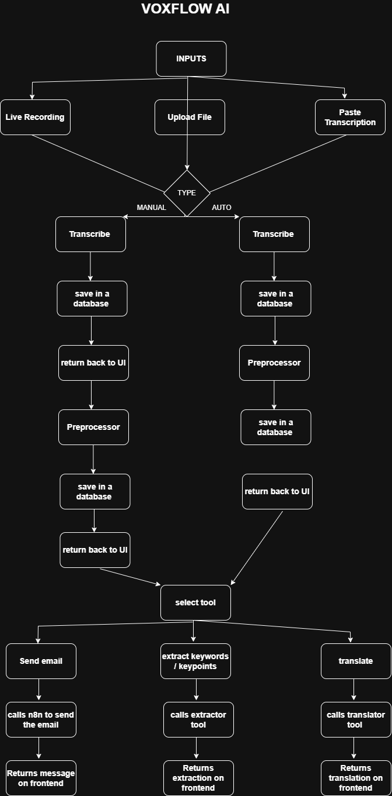
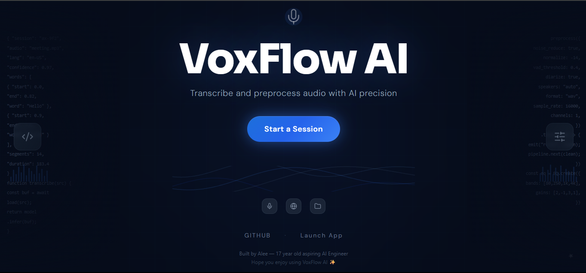
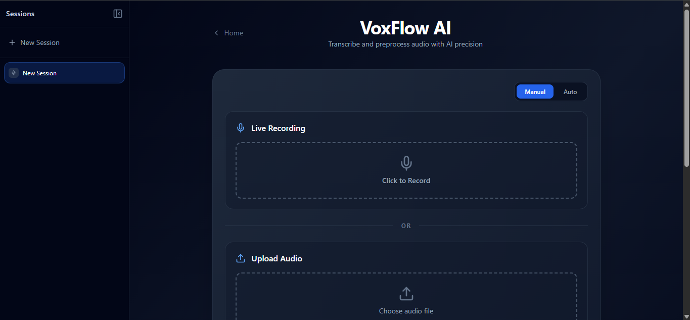

# 🎵 VOXFLOW AI (AI AUDIO PREPROCESSOR)

[](https://www.python.org/)
[](https://fastapi.tiangolo.com/)
[](https://reactjs.org/)
[](https://vitejs.dev/)
[](https://tailwindcss.com/)
[](https://github.com/openai/whisper)
[](https://n8n.io/)
[](https://www.postgresql.org/)
[](https://redis.io/)
[](https://langfuse.com/)
[](https://openrouter.ai/)
[](https://opensource.org/licenses/MIT)

A powerful, AI-driven audio processing application that transcribes audio files, preprocesses transcriptions using advanced language models, and provides additional tools for text manipulation, translation, and communication. This project stands out due to its comprehensive AI engineering approach, featuring a robust FastAPI backend, a modern React frontend, integrated Langfuse observability, and thorough evaluations, showcasing diverse and complete AI engineering skillsets. Built with a modern web frontend and a robust Python backend.

## Why This Project Exists

In today's digital age, audio content is everywhere—from podcasts and lectures to meetings and personal recordings. However, converting this audio into actionable, clean text can be challenging. The Audio Preprocessor bridges this gap by providing:

- **Seamless Transcription**: Convert audio files to text using state-of-the-art AI models
- **Intelligent Preprocessing**: Clean and refine transcriptions using LLMs for better readability
- **Versatile Tools**: Extract text, translate languages, and send processed content via email
- **User-Friendly Interface**: An intuitive web app for easy audio processing
- **Extensible Architecture**: Modular design for easy addition of new features

This project aims to democratize access to advanced audio processing tools, making them available to developers, content creators, and everyday users.

Despite leveraging cutting-edge AI technologies, this project is designed to be straightforward and not overly complex. It solves real-world problems like efficiently transcribing meetings, lectures, or podcasts; cleaning up noisy transcriptions for better readability; and enabling quick actions like translation or email sharing. The modular architecture makes it easy to implement in real-life scenarios, whether for personal productivity, content creation, or business workflows, without requiring deep expertise in AI or full-stack development.

## About the Author

Hi! I'm a 17-year-old aspiring AI engineer passionate about building innovative AI projects. This Audio Preprocessor is one of my creations, born from my fascination with natural language processing, LLMs, and full-stack development. I believe in creating tools that solve real-world problems while pushing the boundaries of what's possible with AI.

This project marks a significant milestone for me as it features a clean, production-ready UI built with React, which is unique compared to my other projects that typically use Streamlit for rapid prototyping. Choosing React was a deliberate step towards creating more professional, scalable user interfaces suitable for real-world applications.

## ✨ Features

- 🎙️ **Audio Transcription**: Support for various audio formats using OpenAI Whisper
- 🧠 **AI-Powered Preprocessing**: Clean and refine transcriptions with GPT and DeepSeek models
- 🌐 **Multi-Language Support**: Translate processed text to over 50 languages
- 📧 **Email Integration**: Send processed results directly via email
- 📝 **Text Extraction**: Extract key information from processed text
- 🎨 **Modern UI**: Beautiful, responsive interface built with React and Tailwind CSS
- 🔄 **Real-time Processing**: Live audio recording and instant transcription
- 📊 **Data Persistence**: Store transcriptions and preprocessing results in JSON Lines format
- 🛠️ **Extensible Tools**: Modular architecture for adding new processing tools

# Demo

Check out the live demo video to see VoxFlow AI in action:

[](https://drive.google.com/file/d/1d_op75ScwyPdvR-QpHw3aOh3T70v_Hm8/view?usp=sharing)

*Click the badge above to watch the demonstration.*

## Technologies Used

### Backend (Python)
- **FastAPI**: High-performance web framework for building APIs
- **OpenAI Whisper**: State-of-the-art speech recognition model
- **OpenRouter API**: Integration with GPT models via OpenRouter
- **OpenAI Models**: Excellent OpenAI Models
- **DeepSeek Models**: Alternative LLM for preprocessing
- **Gemini Models**: Alternative LLM for preprocessing
- **Pydub**: Audio file manipulation
- **Pydantic**: Data validation and serialization
- **Uvicorn**: ASGI server for FastAPI

### Frontend (JavaScript/React)
- **React 19**: Latest version of the popular UI library
- **Vite**: Fast build tool and development server
- **Tailwind CSS**: Utility-first CSS framework
- **Lucide React**: Beautiful icon library
- **ESLint**: Code linting and formatting

### Additional Libraries
- **Deep Translator**: For language translation
- **Requests**: HTTP library for API calls


## Backend Tools and Services

### FastAPI
FastAPI is chosen for this project due to its high performance and ease of use, making it ideal for AI applications. It allows for rapid development of APIs with automatic generation of interactive documentation. FastAPI's asynchronous capabilities enable efficient handling of multiple requests, which is crucial for applications that require real-time processing, such as audio transcription.

### Langfuse
Langfuse is integrated for observability, providing insights into model performance, tracking API calls, and monitoring costs. This integration ensures that we can maintain and optimize our AI components effectively.

### Redis
Redis is integrated specifically for managing transcriptions. Since we utilize a local Whisper model for transcription, which is resource-intensive, Redis helps cache results and improve response times. However, we do not use Redis for preprocessing, despite its token consumption, because our preprocessing feature allows for multiple variations, making caching less beneficial.

### n8n
n8n is employed for workflow automation, particularly for email functionalities. It simplifies the integration of various services, allowing users to create custom workflows for sending processed audio results via email.
- **NOTE:** You will have a json file of the n8n workflow in project root. Just import that in your n8n and setup credentials.

### PostgreSQL
PostgreSQL is chosen for its robustness and reliability as a relational database. It supports complex queries and transactions, making it suitable for storing structured data such as transcriptions and user interactions. Its scalability ensures that the application can handle growing amounts of data efficiently.

## Frontend Overview

The frontend consists of a home page and a tool page, providing a user-friendly interface for audio processing. We have implemented session-based history, allowing users to navigate through their processing history similar to a typical chatbot chat history without losing data.

### Audio Processing Methods
There are two ways to work with audio files:

1. **Manual Processing**: Users upload an audio file, which is transcribed and displayed in an editable box. After reviewing, users can click to process the transcription with AI, resulting in a preprocessed version.

2. **Automatic Processing**: In this mode, the audio file is transcribed and immediately sent for preprocessing, returning the final result directly to the user.

Additionally, users can perform multiple preprocessings, generating different versions of the output. There is also a feature to download all versions of the preprocessings in a Markdown file format.

## Langfuse Integration for Observability

To ensure robust monitoring and debugging capabilities for the AI components, I integrated Langfuse, an open-source LLM observability platform, with the transcriber and preprocessor modules. This integration allows tracking of model calls, performance metrics, costs, and potential issues in real-time.

### How It Works
- **Transcriber Integration**: Each audio transcription request is traced, capturing input audio metadata, model used (Whisper), processing time, and output text quality.
- **Preprocessor Integration**: LLM preprocessing steps (using GPT or DeepSeek models) are monitored, including prompt inputs, model responses, token usage, and any errors encountered.
- **Data Persistence**: Traces are stored in Langfuse for analysis, enabling insights into usage patterns and optimization opportunities.

### Why Observability Matters for AI Applications
Observability is crucial for AI applications because it provides visibility into the "black box" nature of LLMs and AI models. Key benefits include:
- **Performance Monitoring**: Track response times, success rates, and resource usage to identify bottlenecks.
- **Cost Tracking**: Monitor API costs from providers like OpenAI and DeepSeek to optimize spending.
- **Debugging**: Quickly identify and resolve issues with model outputs or integration failures.
- **Reliability**: Ensure consistent performance in production environments through proactive monitoring.
- **Continuous Improvement**: Analyze usage data to refine prompts, select better models, and enhance user experience.

This integration demonstrates a production-ready approach to AI engineering, making the application not just functional but also maintainable and scalable.

## Evaluations

The VoxFlow AI project includes a comprehensive evaluation pipeline to ensure robustness, correctness, and semantic quality of the transcriber and preprocessor modules. Evaluations were conducted on a curated dataset of 7 audio files, covering diverse formats (MP3, WAV, FLAC), content types (conversational speech, technical discussions, noisy environments), and quality variations.

### Transcriber Evaluation
- **Functional Correctness**: Verifies reliable operation without errors or crashes, achieving 100% success across all files.
- **Lexical Similarity**: Assesses textual accuracy through word overlap and string similarity metrics, showing high similarity for all files.

### Preprocessor Evaluation
- **Functional Correctness**: Confirms pipeline reliability and complete output generation, with 100% success.
- **AI-as-Judge Semantic Evaluation**: Uses chain-of-thought reasoning with LLMs to evaluate meaning preservation, information loss, preprocessing quality, hallucination, and confidence. Results show all GOLDEN labels with high confidence (~0.95–1.0), indicating perfect meaning preservation, minimal loss, and zero hallucinations.

### Key Insights
- The pipeline is robust with all functional tests passing.
- Semantic evaluation justifies scores transparently, ensuring interpretability.
- Multi-layered approach (functional, lexical, AI-as-Judge) provides comprehensive validation.

For detailed evaluation methodology, metrics, results, and file structures, refer to `backend/evaluations/about_evaluations.md`.

## Dockerization

Dockerization is essential for modern software development as it ensures consistent environments across different stages of development, testing, and production. By containerizing applications, we eliminate "works on my machine" issues, simplify deployment, and improve scalability. Containers provide isolation, making it easier to manage dependencies and run multiple services without conflicts.

This project relies on multiple external services including n8n for workflow automation, Langfuse for LLM observability, Redis for caching transcriptions, and PostgreSQL for data persistence. To manage these dependencies efficiently, I've created a global shared infrastructure using Docker Compose, setting up a dedicated network that these services share. The VoxFlow AI application connects to this network and utilizes these services seamlessly.

The setup of these external services is not included in this repository to keep the focus on the core application logic. However, configuring such a shared infrastructure is straightforward— a basic tutorial on Docker Compose can guide users to build their own. Alternatively, you can check my GitHub profile for another repository that demonstrates a complete setup of similar shared services.

For those new to Docker, I've documented my learning journey in `docker_learning_documentations.md`. This file contains everything I learned during my first three days of using Docker, including key concepts, commands, and best practices. It's particularly helpful for beginners transitioning from traditional development environments to containerized workflows.

## Architecture



## Project Structure

```
audio_preprocessor/
├── backend/
│   ├── api/
│   │   ├── documentations.md
│   │   ├── main.py
│   │   └── routes/
│   │       ├── preprocess_endpoints.py
│   │       ├── retrieval_endpoints.py
│   │       ├── tools_endpoints.py
│   │       ├── transcriber_endpoints.py
│   │       └── workflow_endpoints.py
│   │
│   ├── configs/
│   │   ├── __init__.py
│   │   ├── main_configs.py
│   │   ├── prompts_configs.py
│   │   └── transcriber_configs.py
│   │
│   ├── core/
│   │   ├── __init__.py
│   │   ├── preprocessor/
│   │   │   ├── preprocessor.py
│   │   │   ├── preprocessor_llm.py
│   │   │   ├── preprocessor_observability.py
│   │   │   └── preprocessor_repository.py
│   │   │
│   │   └── transcriber/
│   │       ├── audio_processor.py
│   │       ├── observability.py
│   │       ├── transcriber.py
│   │       ├── transcription_cache.py
│   │       └── transcription_repository.py
│   │
│   ├── databases/
│   │   ├── database.py
│   │   ├── models.py
│   │   ├── preprocessor_repository.py
│   │   ├── transcriber_repository.py
│   │   ├── preprocessor_eval_query_repository.py
│   │   └── transcriber_eval_query_repository.py
│   │
│   ├── evaluations/
│   │   ├── about_evaluations.md
│   │   ├── runner.py
│   │   │
│   │   ├── preprocessor/
│   │   │   ├── __init__.py
│   │   │   ├── evaluation_databases/
│   │   │   │   ├── functional_executions.json
│   │   │   │   └── judge_executions.jsonl
│   │   │   │
│   │   │   ├── evaluation_results/
│   │   │   │   ├── functional_evaluation_summary.md
│   │   │   │   └── judge_evaluation_summary.md
│   │   │   │
│   │   │   └── evaluation_scripts/
│   │   │       ├── ai_judge/
│   │   │       │   ├── ai_judge.py
│   │   │       │   ├── evaluation_client.py
│   │   │       │   ├── prompt_builder.py
│   │   │       │   ├── reporter.py
│   │   │       │   ├── storage.py
│   │   │       │   └── __init__.py
│   │   │       │
│   │   │       └── functional_correctness/
│   │   │           ├── functional_correctness.py
│   │   │           ├── metrics.py
│   │   │           ├── reporter.py
│   │   │           ├── runner.py
│   │   │           ├── storage.py
│   │   │           ├── verifier.py
│   │   │           ├── about_evals.md
│   │   │           └── __init__.py
│   │   │
│   │   └── transcriber/
│   │       ├── __init__.py
│   │       ├── evaluation_databases/
│   │       │   ├── functional_evaluation_results.jsonl
│   │       │   ├── lexical_evaluations_result.jsonl
│   │       │   ├── transcriptions_data.jsonl
│   │       │   └── transcriptions_reference_data.jsonl
│   │       │
│   │       ├── evaluation_results/
│   │       │   ├── functional_evaluation_summary.md
│   │       │   └── lexical_evaluation_summary.md
│   │       │
│   │       └── evaluation_scripts/
│   │           ├── functional_correctness/
│   │           │   ├── functional_correctness.py
│   │           │   ├── metrics.py
│   │           │   └── about_evals.md
│   │           │
│   │           └── lexical_similarity/
│   │               ├── lexical_similarity.py
│   │               ├── metrics.py
│   │               ├── normalizer.py
│   │               ├── reporter.py
│   │               └── about_evals.md
│   │
│   ├── test_data/
│   │   ├── preprocessor/
│   │   │   ├── preprocessings.jsonl
│   │   │   └── transcriptions_data.jsonl
│   │   │
│   │   └── transcriber/
│   │       ├── valids/
│   │       │   ├── test1.m4a
│   │       │   ├── test2.mp3
│   │       │   ├── test3.wav
│   │       │   ├── test4.flac
│   │       │   ├── test5.opus
│   │       │   ├── test6.aac
│   │       │   ├── test7.wma
│   │       │   └── test8.mp3
│   │       │
│   │       └── invalids/
│   │           ├── test9.pdf
│   │           └── test10.docx
│   │
│   ├── prompts/
│   │   ├── __init__.py
│   │   ├── judge_prompts.py
│   │   ├── preprocessor_prompts.py
│   │   └── text_extractor_prompts.py
│   │
│   ├── pydantic_schemas/
│   │   ├── __init__.py
│   │   ├── prompts.py
│   │   ├── preprocessor_schemas.py
│   │   ├── transcriber_schemas.py
│   │   └── tools_schemas/
│   │
│   ├── tests/
│   │   ├── test_api/
│   │   │   ├── test_main.py
│   │   │   ├── test_preprocessor_endpoints.py
│   │   │   ├── test_retrieval_endpoints.py
│   │   │   └── test_transcriber_endpoints.py
│   │   │
│   │   ├── test_databases/
│   │   │   ├── conftest.py
│   │   │   ├── test_database.py
│   │   │   ├── test_db_preprocessor_repository.py
│   │   │   └── test_transcriber_repository.py
│   │   │
│   │   ├── test_preprocessor/
│   │   │   ├── conftest.py
│   │   │   ├── test_preprocessor.py
│   │   │   ├── test_preprocessor_observability.py
│   │   │   └── test_preprocessor_repository.py
│   │   │
│   │   └── test_transcriber/
│   │       ├── test_audio_processor.py
│   │       ├── test_observability.py
│   │       ├── test_repository.py
│   │       └── test_transcriber.py
│   │
│   ├── tools/
│   │   ├── email_sender.py
│   │   ├── text_extractor.py
│   │   ├── translator.py
│   │   └── __init__.py
│   │
│   ├── utils/
│   │   └── color.py
│   │
│   ├── Dockerfile
│   ├── pyproject.toml
│   ├── uv.lock
│   ├── .dockerignore
│   ├── .env
│   ├── .env.example
│   └── .python-version
│
├── frontend/
│   ├── src/
│   │   ├── App.jsx
│   │   ├── HomePage.jsx
│   │   ├── main.jsx
│   │   ├── index.css
│   │   ├── App.css
│   │   └── assets/
│   │
│   ├── public/
│   ├── dist/
│   ├── Dockerfile
│   ├── nginx.conf
│   ├── package.json
│   ├── package-lock.json
│   ├── vite.config.js
│   ├── tailwind.config.js
│   ├── postcss.config.js
│   ├── eslint.config.js
│   ├── index.html
│   └── .dockerignore
│
├── docker-compose.yml
├── docker_learning_documentations.md
├── init-db.sh
├── README.md
├── .gitignore
├── .env
├── .env.example
├── Architecture.png
└── screenshots_of_projects/
```

## Installation

### Prerequisites
- Python 3.12 or higher
- Node.js 18 or higher
- Git

### Backend Setup

1. **Clone the repository:**
   ```bash
   git clone https://github.com/yourusername/audio_preprocessor.git
   cd audio_preprocessor/backend
   ```

2. **Create a virtual environment:**
   ```bash
   python -m venv venv
   source venv/bin/activate  # On Windows: venv\Scripts\activate
   ```

3. **Install dependencies:**
   ```bash
   pip install -r requirements.txt  # Or use pyproject.toml
   ```

4. **Set up environment variables:**
   Create a `.env` file in the backend directory with:
   ```
   OPENROUTER_API_KEY=""
   LANGFUSE_SECRET_KEY=""
   LANGFUSE_PUBLIC_KEY=""

   OPENROUTER_URL=""
   LANGFUSE_HOST=""
   POSTGRESQL_URL=""
   N8N_WEBHOOK_URL=""

   POSTGRES_PASSWORD=""
   POSTGRES_USER=

   LANGFUSE_PUBLIC_KEY_DOCKER=""
   LANGFUSE_SECRET_KEY_DOCKER=""

   ```

   **Langfuse Configuration:** If using Langfuse Cloud (hosted service), replace `LANGFUSE_HOST` with `LANGFUSE_BASE_URL` and set it to the appropriate cloud URL (e.g., `https://cloud.langfuse.com` for EU or `https://us.cloud.langfuse.com` for US). Self-hosted deployments require `LANGFUSE_HOST` pointing to your local or custom endpoint.
   - also if you want only your docker n8n to be used you can setup one LANGFUSE PUBLIC KEY and LANGFUSE SECRET KEY, in my case I have separate langfuse keys for local development and docker

5. **Run the backend:**
   ```bash
   uvicorn main:app --reload
   ```

### Frontend Setup

1. **Navigate to frontend directory:**
   ```bash
   cd ../frontend
   ```

2. **Install dependencies:**
   ```bash
   npm install
   ```

3. **Run the development server:**
   ```bash
   npm run dev
   ```

4. **Build for production:**
   ```bash
   npm run build
   ```

## Usage

1. **Start the backend server** (runs on `http://localhost:8000`)
2. **Start the frontend** (runs on `http://localhost:5173`)
3. **Open your browser** and navigate to the frontend URL
4. **Upload an audio file** or record live audio
5. **Transcribe** the audio to text
6. **Preprocess** the transcription for cleaning
7. **Use additional tools** like translation or email sending


## Contributing

Contributions are welcome! This project is open-source and I encourage fellow developers, especially young AI enthusiasts, to contribute.

1. Fork the repository
2. Create a feature branch (`git checkout -b feature/AmazingFeature`)
3. Commit your changes (`git commit -m 'Add some AmazingFeature'`)
4. Push to the branch (`git push origin feature/AmazingFeature`)
5. Open a Pull Request

Please read the contributing guidelines (when available) before making contributions.

## Acknowledgments

- OpenAI for Whisper and GPT models
- The FastAPI and React communities
- All the open-source libraries that made this project possible
- My mentors and the AI community for inspiration

## Screenshots





---

*Built with ❤️ by a 17-year-old AI enthusiast*